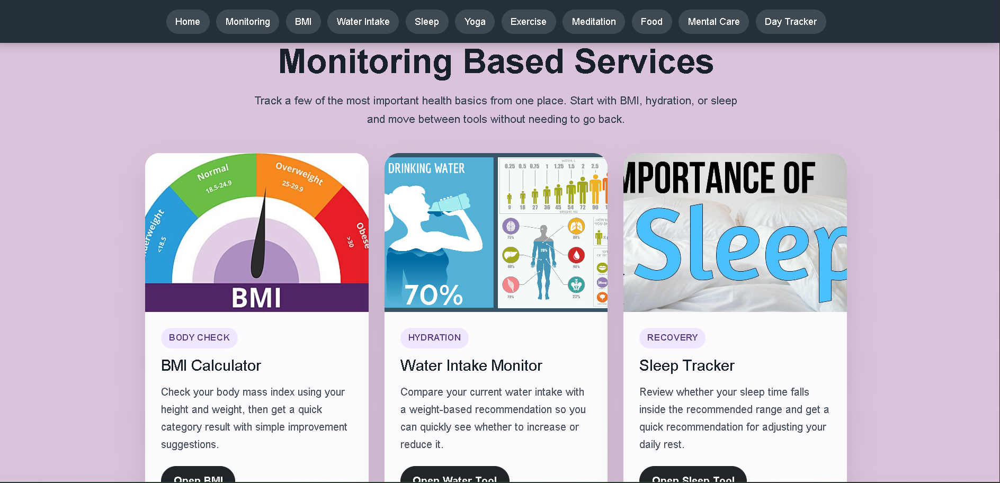
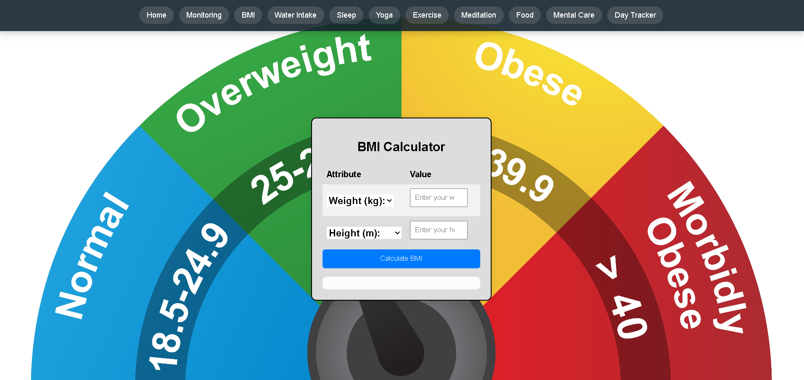
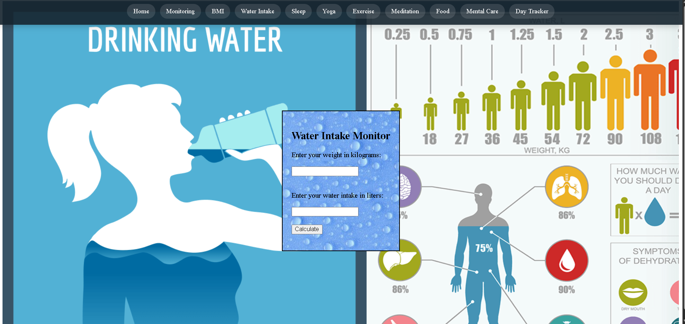
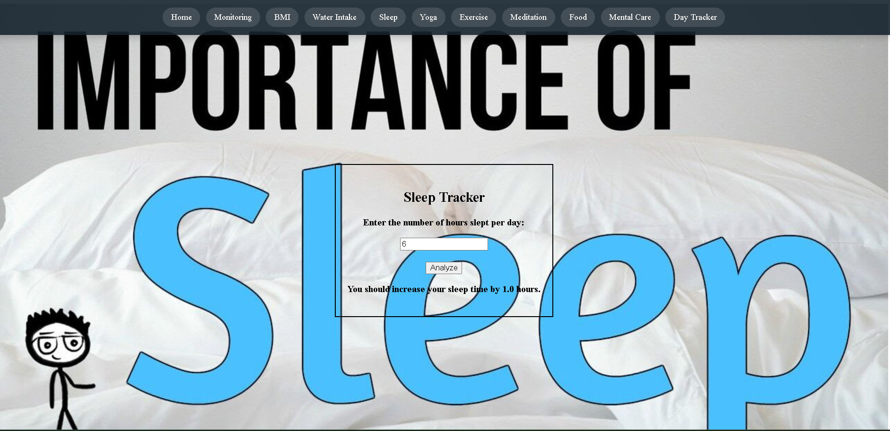

# Health Hub

Health Hub is a health and wellness web application designed to help users explore and maintain a healthy lifestyle. The platform provides information and features related to fitness, nutrition, hydration, sleep, meditation, personal care, appointments, and health monitoring.

## Features

- Fitness and exercise guidance
- Food and nutrition information
- Water intake section
- Sleep and meditation pages
- Personal care content
- Appointment management
- Health monitoring dashboard

## Technologies Used

- HTML5
- CSS3
- JavaScript
- Node.js

## Project Structure

- `data/` – Stores project data
- `images/` – Contains website images
- `src/` – Source files
- HTML files for website pages
- `index.js` – JavaScript functionality
- `package.json` – Project configuration

## Screenshots

### Home Page

### Monitoring Page

### BMI Calculator

### Water Intake Monitor

### Sleep Tracker

### Exercise Page

